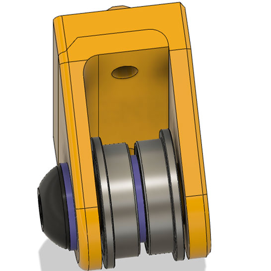
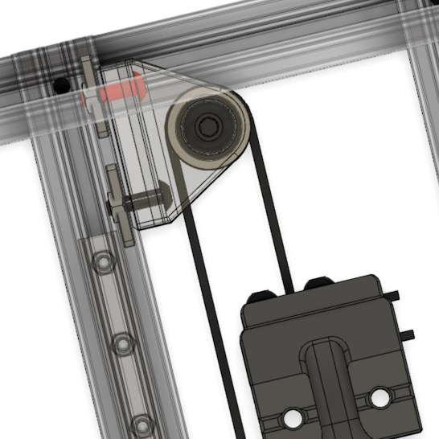
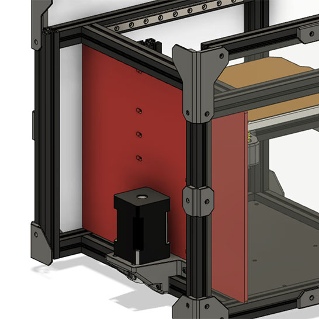
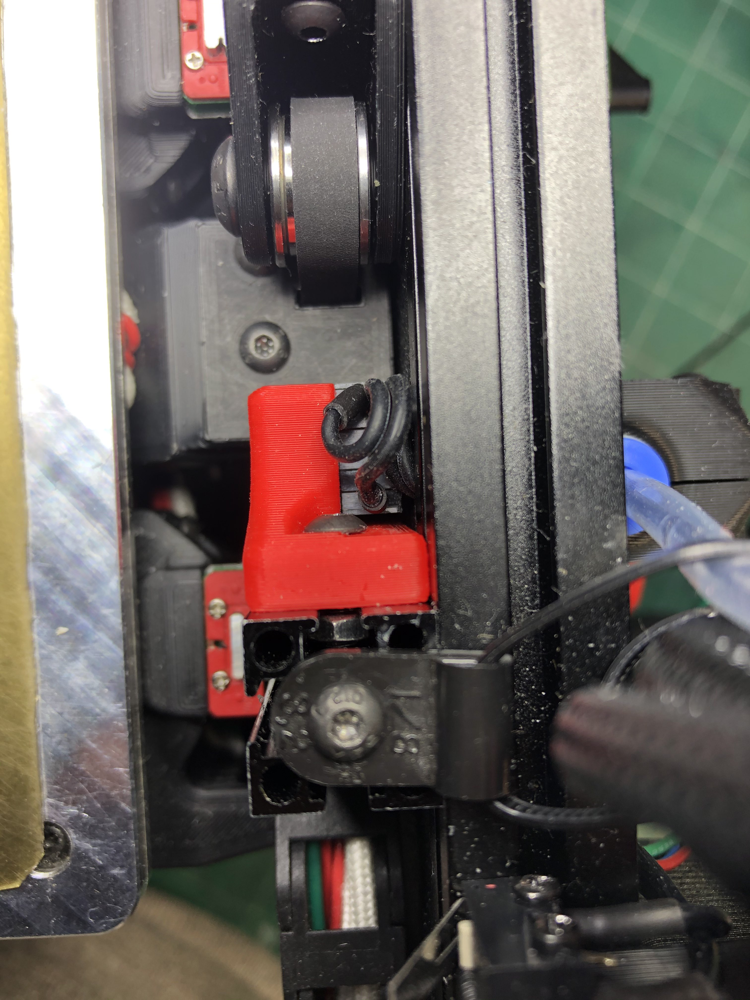

Voron V0 Z Belt mod using a M4 extruder as base.  Designed to take advantage of the 4:1 gearing to prevent the belted Z / bed from dropping when motors are powered off.

<b>This is a beta release. </b> Still testing and some minor design changes may occur.

<b>Design Notes</b>
* Created to be a drop in replacement of the V0 leadscrew with a minimum amount of disassembly (see Disassembly Notes)
*  Belt intensionally offset to the side to have the attached part of the bed mount close to center and to keep the endstop screw in the same stock location to retain the use of the stock Z-endstop
*  Tried to design the bottom mount to utilize existing M3 nuts already in the 1515 extrusions and to provide the same amount of support and rigidity.  All four mounting points leveraged.
*  Bed clamp was designed to be accesible with back panel in place allowing easier access if necessary

# Klipper Stepper Settings:

<b>Old format:</b>
step_distance: .003125

<b>New format:</b>
rotation_distance: 10

# Installation Notes

## Important

If you use stacked bearings for the top idler, a washer/spacer needs to be installed between the bearings (see pic).  Additionally there's a new idler mount as a result.  If you printed the idler prior to  25 Jan 2021 12:25 EST, then the idler mount is too narrow for the spaced bearing and you'll need to print the updated top idler mount.

> Included in the STLs are alternative idler pulley mounts for both smooth and toothed idlers.  I have <b>NOT tested</b> any of the smooth or toothed idlers.  Please let me know if you have an issue or something needs to be tweaked.

> <b>NOTE:</b>  It's important for your M5 screw (or M3 screw if using idler w/3mm I.D.) not to protrude past the idler mount. This will allow you to move the idler mount upward clearing the 1515 extrusion allowing more belt tension.

# Initial belt installation and how to tighten Z-Belt:

## Step 1: 

Secure belt at the bed mount first - this <b><i>is not</b></i> the final belt tension. Final belt tension will be done at step 4.

> <b>Tip:</b>  I found it easier to secure the bottom belt first using both screws, then remove the one longer screw that holds both clips, then secure the top.  Again this is not the final belt tension so don't worry about getting the tension correct at this step.  Final belt tension will be done at step 4.

## Step 2:

Slightly loosen idler mount screws

## Step 3: 

Push idler mount up to desired belt tension and hold.  

> <b>NOTE:</b>  It's important for your M5 screw (or M3 screw if using idler w/3mm I.D.) not to protrude past the idler mount. This will allow you to move the idler mount upward clearing the 1515 extrusion allowing more belt tension.

## Step 4:

While pushing up and when you have the belt tension how you want, secure the top screw

## Step 5:

Finally secure the bottom screw.  Yes, the bottom screw can still be access with the belt in the way.  The belt is flexible enough to move/bend over to access the bottom screw on the idler.  I use the ball end of a hex driver.

# Alternative Idler
Alternatively you can use <b>@hartk V0.108</b> Idler which allows tensioning using a single screw at the top.  It's a very nice idler but you'll need to add some M3 nuts on the horizontal 1515 extrusion.  This can be done by either drilling out an access hole and hiding that hole behind his idler assembly or taking the frame apart slightly.  I opted the lazy route with mine LOL.

# Disassembly Notes:

## For Existing Leadscrew Builds

The frame will <i>not</i> need to be disassebled.  In order to remove the leadscrew Z assembly and to easily install the belt mount you'll need to remove the mid-panel. 

# Troublshooting:

<b>Clicking noise?</b>  If your z belt is clicking while traveling up and down check alignment of both the z-belt and the M4 belt.  It's super easy to over tighten the M4 belt.  If too tight the belt tension will cause the pulley and M4 gear too slightly bow towards each other causing the belt to rub on the side of the pulley and/or M4 gear causing a clicking sound.  When in motion the Z assembly should be nice and smooth with no odd sounds, clicking, or other.  See video below for the amount of noise to expect.

https://www.youtube.com/watch?v=G-tdwrXrc-c

# Addtional Pics:

